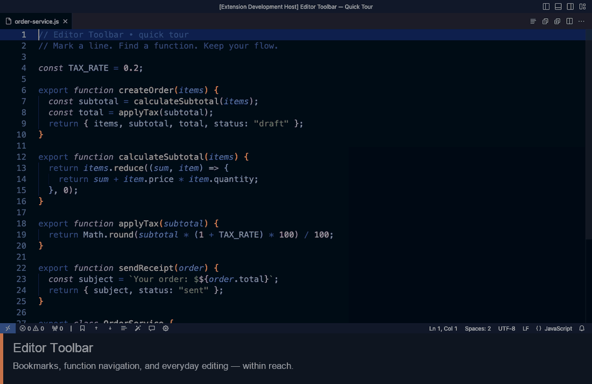

# Editor Toolbar

[](https://marketplace.visualstudio.com/items?itemName=seredalabs.editor-toolbar)
[](https://marketplace.visualstudio.com/items?itemName=seredalabs.editor-toolbar)
[](https://marketplace.visualstudio.com/items?itemName=seredalabs.editor-toolbar&ssr=false#review-details)
[](https://code.visualstudio.com/)
[](LICENSE)

**🔖 Bookmarks, 🔍 function navigation, and everyday editing actions — within reach.**

Editor Toolbar adds a compact status bar and editor-title actions to VS Code.
Mark the code you want to revisit, jump straight to a function, and format,
comment, or fold a document without leaving the editor.

[🇺🇦 Українською](README.uk.md) · [📖 Command reference](docs/commands.md) ·
[⚙️ Settings & language support](docs/settings.md) · [🤝 Contributing](CONTRIBUTING.md)

## 🎬 Demo

<p align="center">
  <a href="images/editor-toolbar-demo.mp4">
    
  </a>
</p>

[Watch the full video (MP4)](images/editor-toolbar-demo.mp4) ·
[Walkthrough and recording instructions](docs/demo/README.md)

Recorded in a real VS Code window with Editor Toolbar 1.3.0. The looping GIF shows
selected feature states; the video includes the full interactions, with captions and no audio.

## 🧭 What you can do

| When you want to… | Use… |
| --- | --- |
| 🔖 Keep your place while editing | Persistent, per-file **bookmarks** that follow edits |
| ⏭️ Move between important lines | **Previous / next bookmark**, with wraparound |
| 📜 See all marked lines | A searchable **bookmark list** with code previews |
| 🔍 Find a function or method | **Functions & Procedures**, grouped by symbol type |
| 🧭 Navigate a large module | Search, sort by name or line, then jump and unfold the target |
| 💬 Clean up or temporarily disable code | One-click **formatting** and **line commenting** |
| 🗂️ Get an overview of a file | **Fold All / Unfold All** in the editor title bar |
| 🎨 Match your workspace | Per-folder bookmark colors and custom detection patterns |

## 📦 Install

Requires **VS Code 1.85.0 or newer**.

1. Obtain an `editor-toolbar-*.vsix` build, or [build it from source](CONTRIBUTING.md#build-a-vsix).
2. In VS Code, open **Extensions** and its **…** menu.
3. Choose **Install from VSIX…**, select the file, and open a text document.

The status bar shows bookmark, format, comment, and settings buttons,
separated from neighboring items by a single vertical divider on the left.
The editor title bar shows the function navigator and fold/unfold buttons.
The status bar controls hide when no text editor is active.

## 🚀 Your first minute

1. **Mark two places.** Put the cursor on a line and choose **Toggle Bookmark**.
   Repeat on another line. Gutter markers show where you left your bookmarks.
2. **Jump between them.** Use **Next Bookmark** or **Previous Bookmark**.
   Navigation wraps around at the end of the current file.
3. **Find a function.** Open **Functions & Procedures**, type part of a name,
   and select a result. The destination opens in the original editor group,
   unfolds, and briefly highlights.
4. **Tidy the view.** Use the title-bar buttons to fold or unfold the file,
   or the status-bar buttons to format it or toggle a line comment.

Try these actions in the included [order-service.js example](docs/demo/order-service.js).
The [demo walkthrough](docs/demo/README.md) describes each action and its result.

## ⌨️ Default shortcuts

These shortcuts are contributed by the extension and apply when the text editor
has focus. They can be changed in **Preferences: Open Keyboard Shortcuts**.

| Action | Default shortcut |
| --- | --- |
| Toggle bookmark | `Ctrl+F2` |
| Next bookmark | `Ctrl+Shift+F2` |
| Previous bookmark | `Shift+F2` |
| List bookmarks in this file | `Ctrl+Alt+F2` |
| Functions & Procedures | `Ctrl+Alt+O` |

On macOS, `Ctrl` means **Control**, not Command; your keyboard may also require
`Fn` for function keys. The extension leaves `F2` available for VS Code's native
Rename Symbol command. Formatting, commenting, and folding retain VS Code's own
bindings. See the [full command reference](docs/commands.md) for command IDs and customization.

## 🔍 Functions & Procedures

The navigator groups results into **Procedures**, **Functions**, **Methods**, and
**Custom**, showing only groups present in the file. Search by name or description;
use the sort button to switch between alphabetical and source order within each group.

It uses the document's language symbol provider first and a best-effort parser
when no function or method symbols are returned. Custom patterns can add results.
For the most accurate navigation in complex syntax, install your language's VS Code
extension. [Language support and parsing limits →](docs/settings.md#language-support)

## 🔖 Bookmarks that follow your work

Bookmarks belong to the current file and are saved in the workspace. They move
with edits, including edits to background documents, and follow file/folder renames
performed through VS Code. Multiple visible editor groups show the same bookmarks.

A bookmark is anchored at the beginning of its line. A multi-line deletion that
consumes that anchor removes the bookmark; undo does not recreate a removed bookmark.
Edits made while VS Code is closed cannot be tracked, so check positions after external
rewrites. Saved positions outside the document are discarded when it is shown.

## 🎨 Make it yours

Set a bookmark color in your user, workspace, or workspace-folder settings:

```json
{
  "editorToolbar.bookmarkColor": "#8b5cf6"
}
```

Changes apply immediately. Add your own function-detection patterns with
`editorToolbar.customPatterns`. [Settings, examples, and limits →](docs/settings.md)

Runtime labels and messages support **English, Ukrainian, and Russian**, following
the VS Code display language. Editor-title actions also appear for untitled and
remote text documents. This is a desktop/remote extension; a browser-only web
extension entry point is not provided.

## 🩺 Troubleshooting

| Symptom | What to check |
| --- | --- |
| The toolbar is missing | Open a text document and confirm the extension is enabled. |
| A shortcut does nothing | Focus the editor; check Keyboard Shortcuts for conflicts or overrides. |
| Format Document does nothing | Install or select a formatter for that language. The button invokes VS Code's formatter. |
| A function is missing | Check the document's language mode and language extension; fallback parsing is approximate. |
| Function detection stopped | Review custom patterns or try a smaller file. Slow parsing is stopped to keep the editor responsive. |
| The function list closed while editing | Reopen it: the old list is closed deliberately to prevent jumps to stale line numbers. |
| A bookmark color is unexpected | Check folder-level overrides and use a supported hexadecimal color. |

For a reproducible bug, [open an issue](https://github.com/SeredaLabs/editor-toolbar/issues)
with your VS Code and extension versions, OS, language mode, a minimal code sample,
and the steps that produced the problem. Remove secrets from examples.

## 🛠️ Development

See [CONTRIBUTING.md](CONTRIBUTING.md) for architecture, tests, isolated profiles,
VSIX packaging, and CI. Release notes are in [CHANGELOG.md](CHANGELOG.md).

[MIT license](LICENSE) · SeredaLabs
